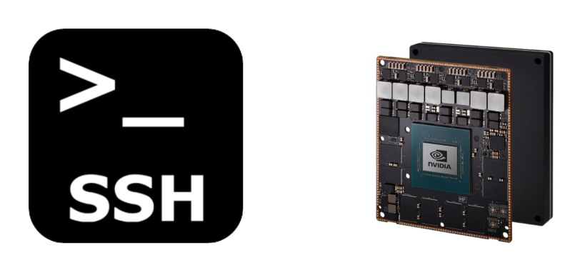

<!-- <a name="myfootnote1">1</a>: Footnote content goes here -->

# Notes for building a DL tool
{: .fs-9 }

*Deepnotes is an ongoing series of notes for a ML pipeline.*

<!-- This is bound to be imperfect so your suggestions are greatly appriciated. -->

{: .fs-6 .fw-300 }

<!-- [Get started now](#getting-started){: .btn .btn-primary .fs-5 .mb-4 .mb-md-0 .mr-2 } [View it on GitHub](https://github.com/ganindu7/deepnotes){: .btn .fs-5 .mb-4 .mb-md-0 } -->

[View it on GitHub](https://github.com/ganindu7/deepnotes){: .btn .btn-primary .fs-5 .mb-4 .mb-md-0 }

---

<!-- ## Getting started -->

## [Setting up communications](./topics/utils/communication_setup#Communicating-with-a-target-device)

when we develop machine learning systems for embedded (or remote) targets it is always convenient to have remote access to these machines, It will enable us to run/debug code remotely or even develop at the same time.       

<!--  -->
<!--   -->

<!-- ## [Enabling C/C++ development headers in a target](./topics/utils/communication_setup#Communicating-with-a-target-device)

According to the documentation for the [l4t-multimedia API](https://docs.nvidia.com/jetson/l4t-multimedia/index.html)  -->

## [Maintaining Reproducibility](./topics/code/Reproducibility#Notes-on-Reproducibility) 

Reproducibility of the training variable flow can help debug and improve networks.

## [Leveraging GStreamer and DeepStream for deep learning pipelines](./topics/utils/gstreamer_and_deepstream#gstreamer-and-deepstream)
GStreamer as a media flow backbone to make deep learning modular and DeepStream to get the best out of nvidia's hardware capabilities.  

## [Using Docker containers](./topics/utils/docker_novice_experiences#why-docker)
Working with docker containers helped me to fail-recover-improve with less overhead and make things more portable. 

 
## [Nets for Image Processing]

*upcoming..*

<!-- [1](#myfootnote1) -->