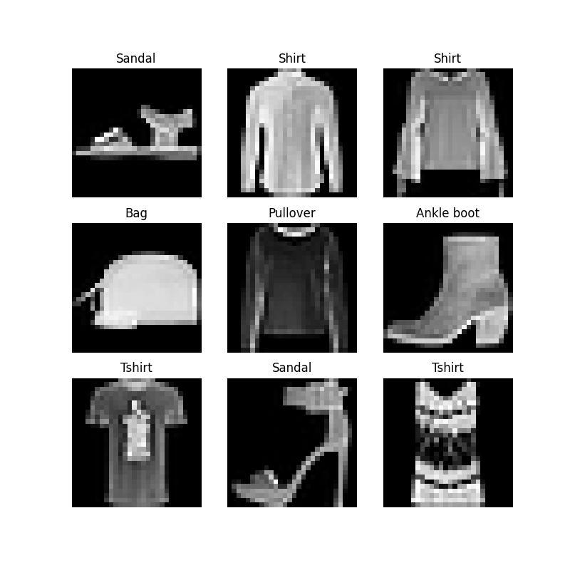

## Tensors and Data Handling with [PyTorch][PYTORCH]
<span style="background-color:LightGreen">
Created : 20/01/2022 | on Linux: 5.4.0-91-generic <br />
Updated: 20/01/2022 | on Linux: 5.4.0-91-generic <br />
Status: Draft
</span>

<span style="background-color:LightYellow"> Check the [**quickstart walkthrough**](../pytorch_walkthrough#Starting-Development-with-PyTorch)  </span>

### Datasets and Data Loaders

Separating dataset handling code (importing, sorting, batching, separating between training, validation and testing) and model training code (matrix operations, error estimation: optimisation gradient navigation) helps keep our workflows modular and reader friendly. The two primitives `torch.utils.Data.DataLoader` and `torch.utils.Data.Dataset` help with the Data side by aiding with pre loaded and custom data. `Dataset` stores the [sample, label] pairs while the `DataLoader` wraps an iterable around `Dataset` to provide functionality such as sampling and batching.


Some [PyTorch Datasets][PYTORCH-DATASETS].

#### Loading a Dataset

```python

import torch 
from torch.utils.data import Dataset
from torchvision import datsets
from torchvision.transforms import toTensor
import matplotlib.pyplot as plt

training_data = datasets.FashionMNIST(root="data",
                                      train=True,
                                      download=True,
                                      transform=ToTensor()
                                      )

test_data = datasets.FashionMNIST(root="data",
                                  train=False,
                                  download=True,
                                  transform=ToTensor()
                                  )

```

#### Dataset Operations: Iteration and Visualisation

We can index the dataset in list form and view them in a plot in a python's "matplotlib" plot

```python

labels_map = {
    0: "T-shirt",
    1: "Trouser",
    2: "Pullover",
    3: "Dress",
    4: "Coat",
    5: "Sandal",
    6: "Shirt",
    7: "Sneaker",
    8: "Bag",
    9: "Ankle boot",
}

figure = plt.figure(figsize=(8,8))
cols, rows = 3, 3
for i in range(1, cols*rows + 1):
    sample_idx = torch.randint(len(training_data), size=(1,)).item()
    img, label = training_data[sample_idx]
    figure.add_subplot(rows, cols, i)
    plt.title(labels_map[label])
    plt.axis("off")
    plt.imshow(img.squeeze(), cmap="gray")

plt.show()
```

Here is a complete code example to achieve what's shown above 

<script src="https://gist.github.com/ganindu7/351906087bd899193c9115c2be8b9187.js?file=visualise_data.py"></script>
<br />
*The output will look like this: Note sometimes there can be incorrectly labeled items in a dataset*



#### creating a custom Dataset

A custom dataset Class must implement three functions. 

* `__init__`
* `__len__`
* `__get_item__`

<script src="https://gist.github.com/ganindu7/351906087bd899193c9115c2be8b9187.js?file=custom_datasets.py"></script>

### `__init__`

The `__init__` function runs once when instantiating the Dataset object. We initialize the directory containing the images, the annotations file and both transforms.

the `labels.csv` looks like below, in the cast if the FashonMNIST dataset the enumerations are taken from the labels map


labels_map = {  <br />
    0: "T-shirt", <br />
    1: "Trouser", <br />
    2: "Pullover", <br />
    3: "Dress", <br />
    4: "Coat", <br />
    5: "Sandal", <br />
    6: "Shirt", <br />
    7: "Sneaker", <br />
    8: "Bag", <br />
    9: "Ankle-boot", <br />
} 


`labels.csv` 

```
tshirt1.jpg, 0 
tshirt2.jpg, 0 
tshirt3.jpg, 0 
...            
Coat0.jpg 4    
...            
Anke-boot234.jpg, 9 
```

```python
    def __init__(self, annotation_file, img_dir, transform=None, target_transform=None):
        self.img_labels = pd.read_csv(annotation_file, names=['file_name', 'label'])
        self.img_dir = img_dir
        self.transform = transform
        self.target_transform = target_transform
```


Source: [PyTorch Tutorial][PyTorch-Tutorial]

[JETSON-URL]: https://developer.nvidia.com/embedded/jetson-agx-xavier-developer-kit
[PYTORCH]: https://pytorch.org
[NVIDIA-PYTORCH-GUIDE]: https://forums.developer.nvidia.com/t/pytorch-for-jetson-version-1-9-0-now-available/72048
[PyTorch-Tutorial]: https://pytorch.org/tutorials/beginner/basics/quickstart_tutorial.html
[FashonMnist-dataset]: https://github.com/zalandoresearch/fashion-mnist
[PYTORCH-DATASETS]: https://pytorch.org/vision/stable/datasets.html

