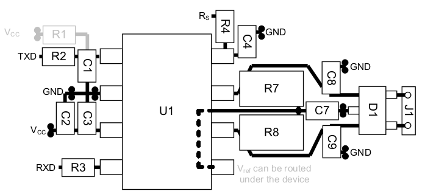

# Using CAN bus with Nvidia AGX Xavier devices
{: .no_toc }

CAN is quite useful to communicate with vehicle ECUs and telemetry systems. In this section we discuss how that can be done for Jetson-AGX Xavier devices
{: .fs-6 .fw-300}
<!--
## Table of contents 
{: .no_toc .text-delta}

1. TOC
{:toc}
-->
Note: This is a Draft

---

              Figure 1. Wiring and pin connections

--- 
## 1. Basic Prerequisites

* Jetson AGX-Xavier developer platform module
* Can Transceiver IC (this can be any suitable IC, we use the [SN65HVD230][SN65HVD230] from TI).

In this example I've used single core PCV thin wall cables (1mm) which is standard in most automotive settings. but you can use 0.5 mm or lower based on the connector and crimp sizes. 
To create twisted pairs you can use a vice and a drill (or hand twist of course). To verify can traffic you can use [PCAN USB PRO][PCAN-USB-PRO] or a [Vector CAN interface][VECTOR-CAN] or check [here][LINUX-CAN-STUFF] for some recommendations from the [embedded Linux community][ELINUX-ORG]. In the Example I've used a [PCAN View][PCAN-VIEW] with a PCAN USB device in a Linux machine( there is a graphical windows interface for MS Windows). 

## Connecting and Configuring the Jetson AGX-Xavier 

 | CAN peripheral          | Controller base address | pins on board | port addr |register    | value | chip conn (SN65HVD230) |
 |-------------------------|-------------------------| ------------- |-----------|------------| ------| -----------------------|
 |  
CAN0
  | mttcan@c310000          | 29            | can0_din  | 0x0c303018 | 0x458 | R (RX)                 |
 |  
"
     | 
"
      | 31            | can0_dout | 0x0c303010 | 0x400 | D (TX)                 |
 |  
CAN1
  | mttcan@c320000          | 29            | can1_din  | 0x0c303008 | 0x458 | R (RX)                 |
 |  
"
     | 
"
      | 31            | can1_dout | 0x0c303000 | 0x400 | D (TX)                 |

code

## Testing and running code

## Connecting to the CAN bus 

            Figure 3. CAN bus, source: [datasheet][SN65HVD230]

## Circuit design ideas 

            Figure 3. PCB Can termination, source: [datasheet][SN65HVD230]

## PCB design ideas 

Because ESD and EFT transients can be between 2Mhz and 3GHz approximately High frequency layout guidelines must be applied to the PCB design. 
To work in machines or vehicle plants external transient protection devices must be used at bus connectors to prevent these transients from propagating into the PCB.

* Use power and ground planes to provide low inductance paths for high frequency signals to dissipate into (rather than onto signal paths) and provide shielding. 
* Design bus protection components in the direction of the signal path. (do not force transients to divert from the signal path to reach the protection device e.g. capacitor) 
* It is advised to use transient voltage suppression devices (TVS) bi directional diodes or varistors and bus filter capacitors, bus transient devices should be placed close to the connector to stop them from coming in. 
* You may use CAN termination on the board but however if it is used the device should be an end node and should not be removed without adding a substitute termination to the bus. (split termination provides common mode filtering from the bus)
* bypass and bulk capacitors must be placed as close to the supply pins of the transceiver. 
* use at least two vias for vcc and ground connections of bypass capacitors and protection devices to minimise trace and via inductance. 
* to limit current via digital lines serial resistors may be used. 
* to filter noise on the digital IO lines a capacitor may be used to close the input side the IO as shown by C1 and C4.
* since the internal pull up and pull down biasing of the device is weak in the face of transients for floating pins an external 1k to 10 k pull up/down should be used to bias the state of the pin nore strongly against the noise during transient events. 
* If D(TxD) is driven via an open drain/collector it should be pulled up to vcc when it is not shorted to GND through the driving gate. (look at R1)
* if the device is only operating on normal mode or slope control R£ is not needed and C4 pads can be used for the pulldown resistor to ground. 
if pin5 is not used it can be left floating. 

            Figure 4. PCB footprint suggestion, source: [datasheet][SN65HVD230]

[SN65HVD230]: https://www.ti.com/lit/ds/symlink/sn65hvd230.pdf
[PCAN-USB-PRO]: https://www.peak-system.com/PCAN-USB-Pro-FD.366.0.html?&L=1
[VECTOR-CAN]: https://www.vector.com/int/en/products/products-a-z/hardware/network-interfaces/vn7640
[LINUX-CAN-STUFF]: https://elinux.org/CAN_Bus
[ELINUX-ORG]: https://elinux.org/
[PCAN-VIEW]: https://www.peak-system.com/PCAN-View.242.0.html?&L=1
